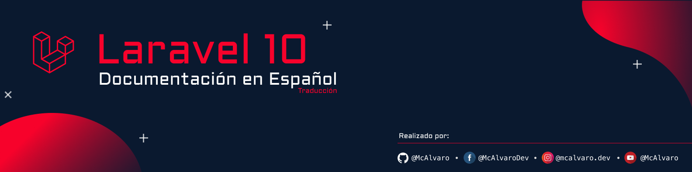

# Bienvenida

<figure><figcaption></figcaption></figure>

¡Bienvenidos al proyecto de traducción a español de la documentación de Laravel 10!

Me complace darles la bienvenida a este proyecto, que tiene como objetivo hacer que la documentación oficial de Laravel esté disponible en español para que sea accesible a más personas en todo el mundo.

Es importante destacar que actualmente este proyecto es llevado adelante por una sola persona, quien está trabajando arduamente para hacerlo realidad. A pesar de ello, estoy comprometido a llevarlo adelante de manera constante y consistente.

Si este contenido te resulta útil y es de valor para ti puedes apoyarme comprandome un cafe a través de:

Tus contribuciones nos permitirán continuar con este proyecto.

**¡Cada granito de arena cuenta!**
